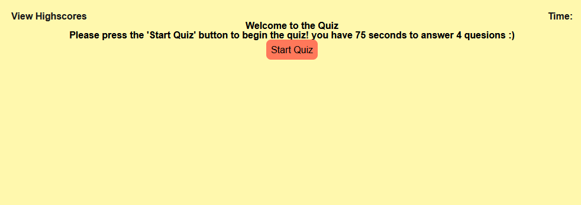
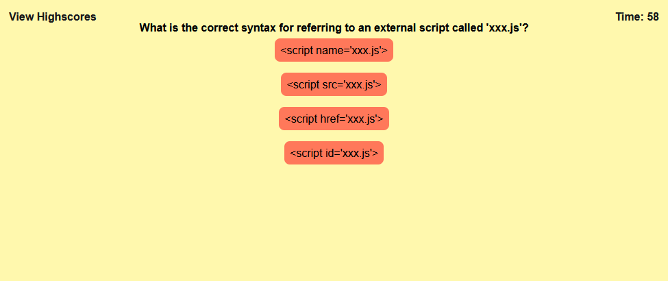
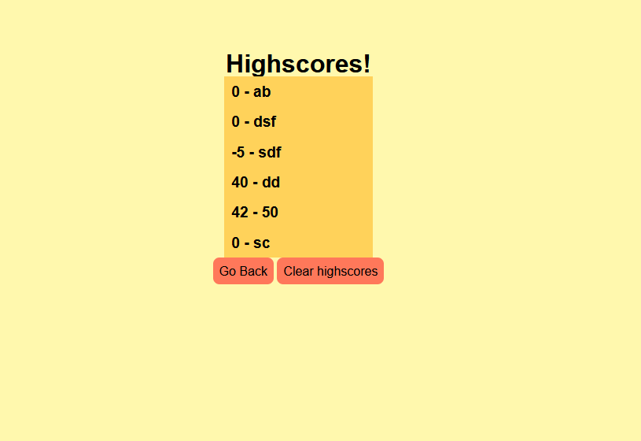

# <week-3-challenge>

## Description

Created the JS for a password generator, witht he ability to choose a length of 8-128 characters and choose what set of characters to include (uppercase, lowercase, symbols, and numbers)

## Table of Contents (Optional)

- [Installation](#installation)
- [Usage](#usage)
- [Credits](#credits)
- [License](#license)

## Installation

run the site either on you own hosting or on the link here:
    https://ghostdads.github.io/Week-4-challenge/index.html

## Usage

click on the start quiz button to start the quiz. 

answer the questions by clicking on the buttons labed with different answers.

once you reach the end of the questions or reach timer 0, enter your initials, press eneter and you can view the high scores.
press the clear scores button to empty local storage and clear out the list.

## Credits

html, CSS, and JS done by me (Alexander Babic)

## License

MIT lisence

---